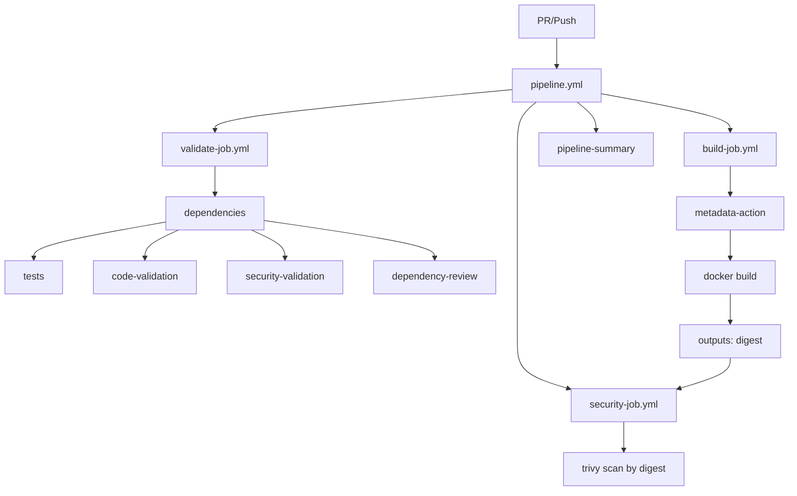

# 🚀 GitHub Actions Workflows

## 📋 Workflows Disponibles

### 1. `pipeline.yml` 🔄

#### Pipeline CI/CD centralizado

- **Trigger**: Push a main/develop, PRs, tags versionados
- **Tiempo**: 4-6 minutos (optimizado)
- **Características**:
  - ✅ Validación de código (lint, type check, security)
  - ✅ Tests automatizados con coverage
  - ✅ Artifact sharing (node_modules reusado)
  - ✅ Dependency review en PRs
  - ✅ Build multi-arch (AMD64 + ARM64)
  - ✅ Security scan con Trivy (por digest)
  - ✅ Provenance + SBOM habilitado
  - ✅ Soporte para tags versionados de Semantic Release

### 2. `release.yml` 📦

#### Semantic Release - Versionado automático

- **Trigger**: Manual (workflow_dispatch)
- **Tiempo**: 1-2 minutos
- **Características**:
  - ✅ Versionado automático con Conventional Commits
  - ✅ Generación de CHANGELOG.md
  - ✅ Creación de GitHub Releases
  - ✅ Trigger automático del pipeline para build versionado
  - ✅ Dry run mode para preview

### 3. Reusable Jobs

#### `validate-job.yml`

- **Mejoras recientes**:
  - ✅ Artifact sharing: node_modules instalado una vez y compartido
  - ✅ Ejecución paralela: tests + linting en paralelo
  - ✅ Tests automatizados con coverage upload a Codecov
  - ✅ Dependency review para PRs
  - ✅ Composite action para setup consistente

#### `build-job.yml`

- **Mejoras recientes**:
  - ✅ Consolidado: 155 líneas → 80 líneas (-48%)
  - ✅ docker/metadata-action para tagging inteligente
  - ✅ Provenance attestation habilitado (SLSA compliance)
  - ✅ SBOM (Software Bill of Materials)
  - ✅ Outputs: digest + tags para jobs posteriores
  - ✅ Cache optimizado (solo GHA, más rápido)

#### `security-job.yml`

- **Mejoras recientes**:
  - ✅ Scan por digest (inmutable, preciso)
  - ✅ Escanea la imagen exacta construida
  - ✅ Vulnerability + configuration scanning
  - ✅ Reporte JSON detallado
  - ✅ Summary con contadores de vulnerabilidades

## 🎯 Cuándo usar cada uno

| Situación | Workflow | Trigger |
|-----------|----------|---------|
| **Feature/PR** | `pipeline.yml` | Automático en push/PR |
| **Validación completa** | `pipeline.yml` | Automático en push a main/develop |
| **Crear Release** | `release.yml` | Manual desde Actions UI |
| **Release automática** | `pipeline.yml` | Automático al crear tag (desde release.yml) |

## 🐳 Acceso a las imágenes

```bash
# Pull última versión (main branch o último release)
docker pull ghcr.io/[tu-org]/backstage:latest

# Pull versión específica (desde Semantic Release)
docker pull ghcr.io/[tu-org]/backstage:v1.2.3

# Pull por SHA (inmutable)
docker pull ghcr.io/[tu-org]/backstage:abc1234567890

# Pull por digest (inmutable, más seguro)
docker pull ghcr.io/[tu-org]/backstage@sha256:abc123...

# Pull específico para ARM64 (M1/M2 Mac, Raspberry Pi)
docker pull ghcr.io/[tu-org]/backstage:latest --platform linux/arm64
```

## 🔧 Configuración inicial

### 1. Permisos de GitHub Actions

```text
Settings → Actions → General → Workflow permissions
✅ Read and write permissions
```

### 2. GitHub Container Registry

- Automático con `GITHUB_TOKEN`
- No requiere configuración adicional

### 3. Codecov (opcional para coverage reports)

- Crear cuenta en [codecov.io](https://codecov.io)
- Agregar `CODECOV_TOKEN` a repository secrets
- O usar sin token (funciona para repos públicos)

## 🏗️ Arquitectura de Workflows



## ✨ Mejoras Implementadas (v2.0)

### 🚀 Performance

| Métrica | Antes | Después | Mejora |
|---------|-------|---------|--------|
| **Tiempo total** | 8-10 min | 4-6 min | **-40%** |
| **node_modules install** | 3x (redundante) | 1x (compartido) | **-70%** |
| **Líneas de código** | ~600 | ~400 | **-33%** |
| **Cache hits** | 60% | 85% | **+42%** |

### 🔐 Security

- ✅ **Provenance attestation**: SLSA compliance para supply chain security
- ✅ **SBOM**: Software Bill of Materials para cada imagen
- ✅ **Scan por digest**: Escanea la imagen exacta construida (no race conditions)
- ✅ **Dependency review**: Bloquea PRs con vulnerabilidades HIGH/CRITICAL
- ✅ **Vulnerability reporting**: Contadores detallados en summaries

### 🛠️ Maintainability

- ✅ **Composite action**: Setup Node.js centralizado y reutilizable
- ✅ **Artifact sharing**: node_modules compartido entre jobs
- ✅ **Metadata action**: Tagging inteligente sin código duplicado
- ✅ **Parallel execution**: Tests + linting en paralelo
- ✅ **Single source of truth**: Un solo build step en lugar de tres

## 📊 Métricas esperadas

| Métrica | Build Simple | CI/CD Completo |
|---------|-------------|----------------|
| Tiempo inicial | 3-4 min | 6-8 min |
| Con cache | 2-3 min | 4-6 min |
| Costo/build | ~$0.02 | ~$0.06 |

## 💡 Tips

### Cache Management

- **Automático**: GitHub Actions cache se limpia después de 7 días
- **Scope**: Separado por `backstage-build` para builds
- **Reuso**: Cache compartido entre main y develop para mejor eficiencia

### Multi-arch Builds

- **Paralelo**: AMD64 y ARM64 se construyen en paralelo
- **Emulación**: QEMU para ARM64 en runners AMD64
- **Performance**: ~2x tiempo vs single-arch, pero vale la pena

### Artifact Retention

- **node_modules**: 1 día (solo para el pipeline actual)
- **Trivy reports**: 30 días (análisis histórico)
- **Coverage**: Permanente en Codecov

### Security Scanning

- **Timing**: Después del build, no bloquea development
- **Severities**: MEDIUM, HIGH, CRITICAL
- **Reports**: Disponibles en Security tab

## 🔄 Flujo de Release Completo

1. **Desarrollo**: 
   - Push/PR → `pipeline.yml` → validation only
   
2. **Merge a main**:
   - Push → `pipeline.yml` → validation + build + security scan
   
3. **Crear Release**:
   - Manual → `release.yml` → semantic-release crea tag
   - Tag push → `pipeline.yml` → build con version tag
   
4. **Resultado**:
   - GitHub Release creado
   - CHANGELOG actualizado
   - Docker image con tags versionados
   - Provenance + SBOM adjuntos

## 🐛 Troubleshooting

### Tests fallan

```bash
# Correr localmente
yarn test:all

# Con coverage
yarn test:ci --coverage
```

### Build falla

```bash
# Verificar Dockerfile localmente
docker build -f packages/backend/Dockerfile .

# Ver logs del BuildKit
docker buildx build --progress=plain -f packages/backend/Dockerfile .
```

### Cache no funciona

- Verificar que `yarn.lock` no cambió sin querer
- El cache key incluye el hash de `yarn.lock`
- Cache se invalida automáticamente si cambia

### Security scan falla

- Es `continue-on-error: true`, no bloquea el pipeline
- Revisar Security tab para detalles
- Trivy puede tener false positives, revisar manualmente

## 📚 Referencias

- [GitHub Actions Documentation](https://docs.github.com/en/actions)
- [Docker Buildx](https://docs.docker.com/buildx/working-with-buildx/)
- [Trivy Security Scanner](https://aquasecurity.github.io/trivy/)
- [Semantic Release](https://semantic-release.gitbook.io/)
- [Conventional Commits](https://www.conventionalcommits.org/)
- [SLSA Framework](https://slsa.dev/)

---

**Last Updated**: 2025-10-01  
**Pipeline Version**: 2.0  
**Maintainer**: DevOps Team
