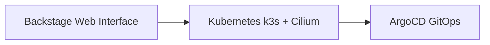

# 🚀 Backstage IDP Platform

[](https://github.com/fede-r1c0/backstage/actions/workflows/docker-build.yml)
[](https://github.com/fede-r1c0/backstage/actions/workflows/security-scan.yml)
[](https://opensource.org/licenses/MIT)

> **Internal Developer Platform (IDP)** built with [Backstage](https://backstage.io/) for infrastructure self-service, service catalog management, and developer productivity tools.

## 🎯 Overview

This project implements a professional-grade Internal Developer Platform using **Backstage** as the foundation. The platform is designed to run on a **homelab Kubernetes cluster** (k3s + Cilium) and serves as a learning environment for real-world DevOps practices while maintaining production-grade standards.

### ✨ Key Features

- 🏗️ **Infrastructure Self-Service**: Automated resource provisioning and management
- 📚 **Service Catalog**: Centralized discovery and documentation of services
- 🔌 **Plugin Ecosystem**: Extensible platform with popular Backstage plugins
- ☸️ **Kubernetes Native**: Designed for k3s with Cilium CNI
- 🚀 **GitOps Deployment**: ArgoCD-managed deployments
- 🔒 **Security First**: Container scanning, dependency audits, and best practices

## 🏗️ Architecture



**Simple and Clean**: Backstage web interface runs on Kubernetes, managed by ArgoCD for GitOps deployment.

### 🧱 Technical Stack

| Component | Technology | Purpose |
|-----------|------------|---------|
| **Platform** | [Backstage](https://backstage.io/) | Core IDP framework |
| **Runtime** | [k3s](https://k3s.io/) | Lightweight Kubernetes |
| **Networking** | [Cilium](https://cilium.io/) | eBPF-based CNI |
| **GitOps** | [ArgoCD](https://argoproj.github.io/argo-cd/) | Deployment automation |
| **Container Registry** | [Docker Hub](https://hub.docker.com/) | Image distribution |
| **CI/CD** | [GitHub Actions](https://github.com/features/actions) | Automated builds |

## 🚀 Quick Start

### Prerequisites

- **Local Development**:
  - Node.js 18+ and npm
  - Docker Desktop
  - Git

- **Production Deployment**:
  - k3s cluster with Cilium CNI
  - ArgoCD installed and configured
  - Docker Hub account with repository access

### 🏠 Local Development

```bash
# 1. Clone the repository
git clone https://github.com/fede-r1c0/backstage.git
cd backstage

# 2. Install dependencies
npm install

# 3. Setup environment configuration
cp app-config.local.yaml.example app-config.local.yaml
# Edit app-config.local.yaml with your local settings

# 4. Start development server
npm run dev

# 5. Open in browser
open http://localhost:3000
```

### 🐳 Docker Build

```bash
# Build the image locally
docker build -t backstage-idp .

# Run the container
docker run -p 3000:3000 \
  -e NODE_ENV=production \
  -e LOG_LEVEL=info \
  backstage-idp

# Test the container
curl http://localhost:3000/health
```

### ☸️ Kubernetes Deployment

```bash
# 1. Ensure ArgoCD is running in your cluster
kubectl get pods -n argocd

# 2. Apply the ArgoCD application
kubectl apply -f argocd/backstage-idp.yaml

# 3. Check deployment status
kubectl get applications -n argocd
kubectl describe application backstage-idp -n argocd

# 4. Access the platform
kubectl port-forward svc/backstage-idp -n backstage 3000:3000
```

## 🔧 Configuration

### Environment Variables

| Variable | Default | Description |
|----------|---------|-------------|
| `NODE_ENV` | `development` | Node.js environment |
| `LOG_LEVEL` | `info` | Logging level |
| `PORT` | `3000` | HTTP server port |
| `DATABASE_URL` | - | PostgreSQL connection string |
| `GITHUB_TOKEN` | - | GitHub API token for integrations |

### Configuration Files

- **`app-config.yaml`**: Base configuration
- **`app-config.local.yaml`**: Local development overrides
- **`app-config.production.yaml`**: Production environment settings

## 🚀 CI/CD Pipeline

Our CI/CD pipeline automatically:

1. **Security Scanning**: Trivy vulnerability scanning + Snyk security analysis
2. **Quality Gates**: Unit tests, integration tests, linting, type checking
3. **Docker Build**: Multi-architecture builds (ARM64 + x86_64)
4. **Image Push**: Automatic push to Docker Hub with semantic tagging
5. **Deployment**: ArgoCD sync for GitOps deployment

### Pipeline Triggers

- **Push to `main`**: Production deployment
- **Push to `develop`**: Staging deployment
- **Pull Request**: Quality checks and security scanning

## 🔌 Plugin Ecosystem

### 🎯 Core Backstage Plugins (Default)

| Plugin | Purpose | Status |
|--------|-----------|--------|
| **@backstage/plugin-catalog-backend** | Service catalog management | ✅ Active |
| **@backstage/plugin-scaffolder-backend** | Project creation from templates | ✅ Active |
| **@backstage/plugin-techdocs-backend** | Technical documentation | ✅ Active |
| **@backstage/plugin-search-backend** | Search engine | ✅ Active |
| **@backstage/plugin-kubernetes-backend** | Kubernetes integration | ✅ Active |
| **@backstage/plugin-auth-backend** | Authentication system | ✅ Active |
| **@backstage/plugin-notifications-backend** | Notification system | ✅ Active |
| **@backstage/plugin-signals-backend** | Signals system | ✅ Active |
| **@backstage/plugin-permission-backend** | Permission system | ✅ Active |
| **@backstage/plugin-proxy-backend** | Proxy for external services | ✅ Active |

### 🚀 Integrated External Plugins

| Plugin | Purpose | Configuration | Status |
|--------|-----------|---------------|--------|
| **@roadiehq/backstage-plugin-argo-cd** | ArgoCD integration for GitOps | Proxy to `192.168.70.102` | ✅ Active |
| **@backstage-community/plugin-github-actions** | GitHub Actions visualization | GitHub.com integration | ✅ Active |

### 🔧 Integration Configuration

#### **ArgoCD Integration**

```yaml
# app-config.yaml
proxy:
  '/argocd/api':
    target: ${ARGOCD_API_URL}
    changeOrigin: true
    secure: false
    headers:
      Cookie: $env: ARGOCD_AUTH_TOKEN
```

#### **GitHub Integration**

```yaml
# app-config.yaml
integrations:
  github:
    - host: github.com
      token: ${GITHUB_TOKEN}

auth:
  providers:
    github:
      development:
        clientId: ${AUTH_GITHUB_CLIENT_ID}
        clientSecret: ${AUTH_GITHUB_CLIENT_SECRET}
```

### 📱 EntityPage Implementation

#### **ArgoCD Card**

- Displayed in Overview when available
- Integrated with `EntityArgoCDOverviewCard`
- Conditional on `isArgocdAvailable()`

#### **GitHub Actions Tab**

- Dedicated tab at `/github-actions`
- Integrated with `EntityGithubActionsContent`
- Conditional on `isGithubActionsAvailable()`

## 🧪 Testing

```bash
# Run all tests
npm test

# Run specific test suites
npm run test:unit          # Unit tests
npm run test:integration   # Integration tests
npm run test:coverage      # Coverage report

# Linting and type checking
npm run lint               # ESLint
npm run lint:fix          # Auto-fix linting issues
npm run type-check        # TypeScript compilation check
```

## 📊 Monitoring & Health

### Health Endpoints

- **`/health`**: Basic health check
- **`/metrics`**: Prometheus metrics
- **`/ready`**: Readiness probe for Kubernetes

### Key Metrics

- HTTP request duration
- Memory usage
- Plugin performance
- Database connection status

## 🔒 Security

### Container Security

- **Base Image**: Alpine Linux (minimal attack surface)
- **User**: Non-root user (`backstage:1001`)
- **Vulnerability Scanning**: Trivy + Snyk integration
- **Dependency Audits**: Automated npm audit in CI/CD

### Best Practices

- Regular security updates
- Principle of least privilege
- Secrets management via Kubernetes
- Network policies with Cilium

## 📚 Documentation

- **[Deployment Guide](docs/DEPLOYMENT.md)**: Detailed deployment instructions
- **[Plugin Development](docs/PLUGINS.md)**: How to create custom plugins
- **[API Reference](docs/API.md)**: Backend API documentation
- **[Troubleshooting](docs/TROUBLESHOOTING.md)**: Common issues and solutions

## 📄 License

This project is licensed under the MIT License - see the [LICENSE](LICENSE) file for details.
