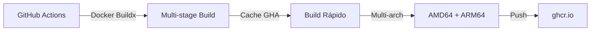

# 🚀 Estrategia CI/CD para Backstage

## 📊 Decisiones Arquitectónicas

### ¿Por qué GitHub Container Registry (ghcr.io)?

| Criterio | ghcr.io | Docker Hub | Decisión |
|----------|---------|------------|----------|
| **Costo** | ✅ Gratis (repos públicos) | ⚠️ Rate limits | **ghcr.io** |
| **Integración** | ✅ Nativa con GitHub | ❌ Requiere secretos | **ghcr.io** |
| **Límites** | ✅ Sin límites de pull | ❌ 100 pulls/6h anónimo | **ghcr.io** |
| **Permisos** | ✅ GITHUB_TOKEN automático | ❌ Manual | **ghcr.io** |

### ¿Por qué Docker Buildx?

| Tecnología | Multi-arch | Cache | Velocidad | Complejidad | Decisión |
|------------|------------|-------|-----------|-------------|----------|
| **Buildx** | ✅ Nativo | ✅ GitHub Actions cache | ✅ Rápido | ✅ Simple | **GANADOR** |
| Kaniko | ⚠️ Complejo | ⚠️ Limitado | ❌ Lento | ❌ Complejo | No |
| Docker std | ❌ No | ⚠️ Básico | ✅ Rápido | ✅ Simple | No |

### Estrategia de Build: Multi-stage con Cache Optimizado



## 📈 Optimizaciones Implementadas

### 1. **Caching Multi-nivel**
```yaml
# GitHub Actions cache (más rápido)
cache-from: type=gha
cache-to: type=gha,mode=max

# BuildKit cache mounts en Dockerfile
--mount=type=cache,target=/var/cache/apt
```

### 2. **Build Condicional**
- Solo rebuilds cuando hay cambios relevantes
- PRs no pushean imágenes (solo validan)
- Main siempre pushea latest

### 3. **Multi-arch Eficiente**
- QEMU solo para emulación necesaria
- Build paralelo de arquitecturas
- Un solo job para ambas arquitecturas

## 🎯 Métricas de Rendimiento

| Métrica | Valor Esperado | Baseline |
|---------|----------------|----------|
| **Build inicial** | ~5-7 min | 15-20 min |
| **Build con cache** | ~3-4 min | 10-12 min |
| **Uso de minutos (mes)** | ~500-800 | 2000+ |
| **Costo mensual** | $0 (free tier) | $0-50 |

## 🔧 Uso de los Workflows

### Workflow Simple: `build-docker.yml`
```bash
# Se activa automáticamente con:
git push origin main

# O manualmente desde GitHub UI:
Actions → build-docker.yml → Run workflow
```

### Workflow Completo: `ci-cd-complete.yml`
```bash
# Se activa con:
- Push a main/develop
- Creación de release
- Pull requests
- Manual desde UI
```

### Pull de Imágenes
```bash
# Última versión
docker pull ghcr.io/[tu-usuario]/backstage:latest

# Versión específica
docker pull ghcr.io/[tu-usuario]/backstage:main-abc1234

# Para ARM64
docker pull ghcr.io/[tu-usuario]/backstage:latest --platform linux/arm64
```

## 🚨 Troubleshooting

### Error: "Permission denied to packages"
```bash
# Solución: Settings → Actions → General
# Workflow permissions: Read and write permissions
```

### Build falla con "out of space"
```bash
# Solución en workflow:
- name: Clean buildx cache
  run: docker buildx prune --force
```

### Cache no funciona
```bash
# Verificar:
1. GitHub Actions → Caches (debe mostrar entradas)
2. Logs del build (debe decir "importing cache")
3. Cache key no cambió (yarn.lock)
```

## 📊 Monitoreo

### Métricas Clave
1. **Tiempo de build** - Target: < 5 min
2. **Tasa de éxito** - Target: > 95%
3. **Uso de minutos** - Alert: > 1500/mes
4. **Tamaño de imagen** - Alert: > 500MB

### Dashboard
```
GitHub → Insights → Actions → Usage
- Workflow runs por día
- Tiempo total usado
- Storage consumido
```

## 🔐 Seguridad Implementada

- ✅ **No secretos en código**
- ✅ **GITHUB_TOKEN automático**
- ✅ **Scanning con Trivy** (workflow completo)
- ✅ **Permisos mínimos declarados**
- ✅ **Multi-arch signed images**

## 💡 Mejores Prácticas Aplicadas

1. **KISS**: Workflows simples y mantenibles
2. **DRY**: Reutilización de GitHub Actions oficiales
3. **Fast Feedback**: Builds rápidos en PRs
4. **GitOps Ready**: Tags consistentes y predecibles
5. **Zero External Dependencies**: Todo en GitHub

## 📝 Desarrollo Local

### Test del build localmente
```bash
# Build single-arch para testing
docker build -f packages/backend/Dockerfile -t backstage:local .

# Run local
docker run -p 7007:7007 backstage:local

# Build multi-arch (requiere buildx)
docker buildx build \
  --platform linux/amd64,linux/arm64 \
  -f packages/backend/Dockerfile \
  -t backstage:local .
```

### Debug del Workflow
```bash
# Habilitar debug logs:
# Settings → Secrets → Actions → New repository secret
# Name: ACTIONS_STEP_DEBUG
# Value: true
```

## 📚 Referencias

- [Backstage Docker Docs](https://backstage.io/docs/deployment/docker)
- [GitHub Container Registry](https://docs.github.com/en/packages/working-with-a-github-packages-registry/working-with-the-container-registry)
- [Docker Buildx](https://docs.docker.com/build/building/multi-platform/)
- [GitHub Actions Best Practices](https://docs.github.com/en/actions/learn-github-actions/best-practices)

---

**Mantenido por**: [@fede-r1c0](https://github.com/fede-r1c0)
**Última actualización**: 2025
**Filosofía**: "Simplicidad sobre complejidad, automatización sobre scripts"