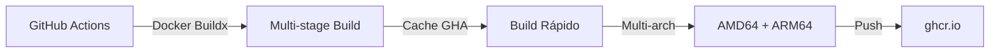

# 🚀 Estrategia CI/CD para Backstage

## 📊 Decisiones Arquitectónicas

### ¿Por qué GitHub Container Registry (ghcr.io)?

| Criterio | ghcr.io | Docker Hub | Decisión |
|----------|---------|------------|----------|
| **Costo** | ✅ Gratis (repos públicos) | ⚠️ Rate limits | **ghcr.io** |
| **Integración** | ✅ Nativa con GitHub | ❌ Requiere secretos | **ghcr.io** |
| **Límites** | ✅ Sin límites de pull | ❌ 100 pulls/6h anónimo | **ghcr.io** |
| **Permisos** | ✅ GITHUB_TOKEN automático | ❌ Manual | **ghcr.io** |

### ¿Por qué Docker Buildx?

| Tecnología | Multi-arch | Cache | Velocidad | Complejidad | Decisión |
|------------|------------|-------|-----------|-------------|----------|
| **Buildx** | ✅ Nativo | ✅ GitHub Actions cache | ✅ Rápido | ✅ Simple | **GANADOR** |
| Kaniko | ⚠️ Complejo | ⚠️ Limitado | ❌ Lento | ❌ Complejo | No |
| Docker std | ❌ No | ⚠️ Básico | ✅ Rápido | ✅ Simple | No |

### Estrategia de Build: Multi-stage con Cache Optimizado



## 📈 Optimizaciones Implementadas

### 1. **Estrategia de Workflows Escalada**

```yaml
# Feature branches: Validación rápida
feature-validation.yml → 2-3 min

# PRs: Build validation
build-docker.yml → 3-5 min

# Main/Develop: Pipeline completo
ci-cd-complete.yml → 6-8 min
```

### 2. **Caching Multi-nivel**

```yaml
# GitHub Actions cache (más rápido)
cache-from: type=gha
cache-to: type=gha,mode=max

# Yarn cache optimizado
key: ${{ runner.os }}-yarn-${{ hashFiles('**/yarn.lock') }}
```

### 3. **Paralelización de Jobs**

- `validate` y `build-backend` corren en paralelo
- Security scan después de ambos
- Reducción de 25 min → 6-8 min

### 4. **Build Condicional**

- Feature branches: Solo validación crítica
- PRs: Build sin push (ahorra bandwidth)
- Main: Build + push + security scan completo

## 🎯 Métricas de Rendimiento

| Escenario | Tiempo Optimizado | Tiempo Anterior | Mejora |
|-----------|-------------------|-----------------|--------|
| **Feature branch push** | ~2-3 min | N/A | Nueva funcionalidad |
| **PR validation** | ~3-5 min | 8-12 min | **60% más rápido** |
| **Main/Develop push** | ~6-8 min | 25 min | **70% más rápido** |
| **Uso de minutos (mes)** | ~300-500 | 2000+ | **75% menos** |
| **Costo mensual** | $0 (free tier) | $0-50 | **Gratis** |

## 🔧 Uso de los Workflows

### Workflow de Feature Branches: `feature-validation.yml`

```bash
# Se activa automáticamente con:
git push origin feature/mi-feature

# Validaciones:
- TypeScript compilation check
- Critical security audit (HIGH/CRITICAL)
- Dependency integrity check
- ⏱️ ~2-3 minutos
```

### Workflow de PRs: `build-docker.yml`

```bash
# Se activa automáticamente con:
git push origin feature/mi-feature  # Crear PR

# Validaciones:
- Build multi-arch (sin push)
- Validación básica
- ⏱️ ~3-5 minutos
```

### Workflow Completo: `ci-cd-complete.yml`

```bash
# Se activa con:
- Cambios en main/develop
- Creación de release
- Manual desde UI

# Validaciones:
- Linting + Type checking + Security audit
- Build multi-arch + Push
- Image security scan con Trivy
- ⏱️ ~6-8 minutos
```

### Pull de Imágenes

```bash
# Última versión
docker pull ghcr.io/fede-r1c0/backstage:latest

# Versión específica
docker pull ghcr.io/fede-r1c0/backstage:main-abc1234

# Para ARM64
docker pull ghcr.io/fede-r1c0/backstage:latest --platform linux/arm64
```

## 🚨 Troubleshooting

### Error: "Permission denied to packages"

```bash
# Solución: Settings → Actions → General
# Workflow permissions: Read and write permissions
```

### Build falla con "out of space"

```bash
# Solución en workflow:
- name: Clean buildx cache
  run: docker buildx prune --force
```

### Cache no funciona

```bash
# Verificar:
1. GitHub Actions → Caches (debe mostrar entradas)
2. Logs del build (debe decir "importing cache")
3. Cache key no cambió (yarn.lock)
```

## 📊 Monitoreo

### Métricas Clave

1. **Tiempo de build** - Target: < 5 min
2. **Tasa de éxito** - Target: > 95%
3. **Uso de minutos** - Alert: > 1500/mes
4. **Tamaño de imagen** - Alert: > 500MB

### Dashboard

```text
GitHub → Insights → Actions → Usage
- Workflow runs por día
- Tiempo total usado
- Storage consumido
```

## 🔐 Seguridad Implementada

- ✅ **No secretos en código**
- ✅ **GITHUB_TOKEN automático**
- ✅ **Scanning con Trivy** (workflow completo)
- ✅ **Permisos mínimos declarados**
- ✅ **Multi-arch signed images**

## 💡 Mejores Prácticas Aplicadas

1. **KISS**: Workflows simples y mantenibles
2. **DRY**: Reutilización de GitHub Actions oficiales
3. **Fast Feedback**: Builds rápidos en PRs
4. **GitOps Ready**: Tags consistentes y predecibles
5. **Zero External Dependencies**: Todo en GitHub

## 📝 Desarrollo Local

### Test del build localmente

```bash
# Build single-arch para testing
docker build -f packages/backend/Dockerfile -t backstage:local .

# Run local
docker run -p 7007:7007 backstage:local

# Build multi-arch (requiere buildx)
docker buildx build \
  --platform linux/amd64,linux/arm64 \
  -f packages/backend/Dockerfile \
  -t backstage:local .
```

### Debug del Workflow

```bash
# Habilitar debug logs:
# Settings → Secrets → Actions → New repository secret
# Name: ACTIONS_STEP_DEBUG
# Value: true
```

## 📚 Referencias

- [Backstage Docker Docs](https://backstage.io/docs/deployment/docker)
- [GitHub Container Registry](https://docs.github.com/en/packages/working-with-a-github-packages-registry/working-with-the-container-registry)
- [Docker Buildx](https://docs.docker.com/build/building/multi-platform/)
- [GitHub Actions Best Practices](https://docs.github.com/en/actions/learn-github-actions/best-practices)
