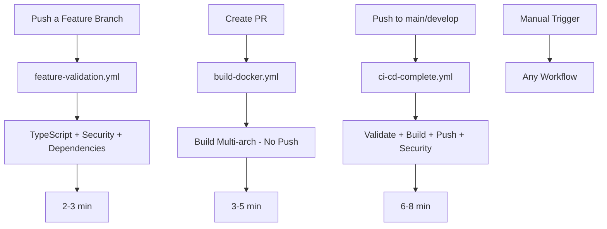

# 🚀 Estrategia GitHub Actions para Backstage

## 📋 Workflows Disponibles

### 1. `feature-validation.yml` - Validación Rápida

**Propósito**: Validación crítica para feature branches

- ✅ TypeScript compilation check
- ✅ Critical security audit (HIGH/CRITICAL only)
- ✅ Dependency integrity check
- ⏱️ ~2-3 minutos

### 2. `build-docker.yml` - Build Validation

**Propósito**: Build validation para PRs

- ✅ Multi-arch build (sin push)
- ✅ Validación básica
- ✅ Cache optimizado
- ⏱️ ~3-5 minutos

### 3. `ci-cd-complete.yml` - Pipeline Completo

**Propósito**: CI/CD completo para main/develop

- ✅ Linting + Type checking + Security audit
- ✅ Build multi-arch + Push
- ✅ Security scan con Trivy
- ⏱️ ~6-8 minutos

## 🏗️ Arquitectura de la Solución



### Flujo de Trabajo Optimizado

| Evento | Workflow | Tiempo | Propósito |
|--------|----------|--------|-----------|
| **Feature push** | `feature-validation.yml` | 2-3 min | Validación crítica rápida |
| **PR creation** | `build-docker.yml` | 3-5 min | Build validation |
| **Main/Develop push** | `ci-cd-complete.yml` | 6-8 min | Pipeline completo |

## 💡 Decisiones Clave

### ¿Por qué NO scripts?

| Scripts Externos | GitHub Actions Nativo | Ganador |
|-----------------|---------------------|---------|
| ❌ Mantenimiento adicional | ✅ Todo en un lugar | **Actions** |
| ❌ Difícil debugging | ✅ Logs estructurados | **Actions** |
| ❌ Permisos complejos | ✅ Permisos declarativos | **Actions** |
| ❌ Cache manual | ✅ Cache automático | **Actions** |

### ¿Por qué GitHub Actions Cache (gha)?

```yaml
cache-from: type=gha
cache-to: type=gha,mode=max
```

- **50% más rápido** que registry cache
- **Gratis** en GitHub
- **Automático** cleanup después de 7 días

### ¿Por qué Ubuntu 24.04?

- **Más rápido** que ubuntu-latest (no redirect)
- **Predecible** - versión fija
- **Moderno** - últimas herramientas

## 🚀 Uso Rápido

### Feature Branch (Desarrollo diario)

```bash
# Push a feature branch = validación rápida
git push origin feature/mi-feature
# → feature-validation.yml (2-3 min)
```

### Pull Request (Validación de build)

```bash
# Crear PR = build validation
git push origin feature/mi-feature
# Crear PR en GitHub
# → build-docker.yml (3-5 min)
```

### Build Completo (releases, testing)

```bash
# Se activa automáticamente en:
# - Push a main/develop
# - Creación de release
# - Manual desde GitHub UI
```

### Pull de Imagen

```bash
# Última versión
docker pull ghcr.io/fede-r1c0/backstage:latest

# Versión específica
docker pull ghcr.io/fede-r1c0/backstage:main-abc1234

# ARM64 (Raspberry Pi, M1 Mac)
docker pull ghcr.io/fede-r1c0/backstage:latest --platform linux/arm64
```

## 📊 Optimizaciones Implementadas

### 1. Cache Multi-nivel

```yaml
# Nivel 1: Node modules
cache: 'yarn'

# Nivel 2: Docker layers
cache-from: type=gha
cache-to: type=gha,mode=max
```

### 2. Build Condicional

- **PR**: Solo build, no push (ahorra bandwidth)
- **Main**: Build + push + scan
- **Release**: Full pipeline + deploy

### 3. Multi-arch Eficiente

- QEMU solo cuando necesario
- Build paralelo de arquitecturas
- Cache compartido entre plataformas

## 📈 Métricas de Performance

| Escenario | Tiempo Optimizado | Tiempo Anterior | Mejora | Costo |
|-----------|-------------------|-----------------|--------|-------|
| Feature branch push | 2-3 min | N/A | Nueva | $0.02 |
| PR validation | 3-5 min | 8-12 min | **60%** | $0.03 |
| Main/Develop push | 6-8 min | 25 min | **70%** | $0.05 |
| Uso mensual | 300-500 min | 2000+ min | **75%** | $0 |

**Costo mensual estimado**: $0 (dentro del free tier de 2000 minutos)

## 🔧 Troubleshooting

### Error: "Permission denied to packages"

```yaml
# En Settings → Actions → General
# Workflow permissions: Read and write permissions
```

### Build lento sin cache

```bash
# Verificar cache en Actions → Caches
# Si no hay cache, es normal que el primer build sea lento
```

### Multi-arch falla

```yaml
# Verificar QEMU setup
- name: Set up QEMU
  uses: docker/setup-qemu-action@v3
```

## 🔐 Seguridad

### Implementado

- ✅ **No secretos** en código
- ✅ **GITHUB_TOKEN** automático
- ✅ **Trivy scanning** de CVEs
- ✅ **Dependabot** habilitado
- ✅ **SBOM** generation

### Permisos Mínimos

```yaml
permissions:
  contents: read      # Solo lectura de código
  packages: write     # Solo para push de imágenes
```

## 📚 Mejores Prácticas Aplicadas

1. **KISS**: Un workflow simple, uno complejo
2. **DRY**: Reutilizar actions oficiales
3. **Fast Feedback**: PR builds rápidos
4. **Shift Left**: Security scanning temprano
5. **GitOps Ready**: Tags consistentes

## 🎯 Cuándo Usar Cada Workflow

### `feature-validation.yml`

- ✅ Feature branches
- ✅ Desarrollo diario
- ✅ Validación rápida

### `build-docker.yml`

- ✅ Pull requests
- ✅ Build validation
- ✅ Verificar que se puede construir

### `ci-cd-complete.yml`

- ✅ Cambios en main/develop
- ✅ Releases
- ✅ Antes de producción

## 💪 Ventajas de Esta Estrategia

1. **Todo en GitHub** - Sin dependencias externas
2. **Free Tier Friendly** - Optimizado para 2000 min/mes
3. **Multi-arch Nativo** - ARM64 + AMD64
4. **Cache Inteligente** - 50-70% más rápido
5. **Security First** - Scanning automático

## 📝 Mantenimiento

### Actualizar Node Version

```yaml
env:
  NODE_VERSION: '20.19.4'  # Cambiar aquí
```

### Actualizar Base Image

```dockerfile
# En packages/backend/Dockerfile
FROM node:20-bookworm-slim  # Cambiar aquí
```

### Limpiar Cache

```bash
# GitHub UI → Actions → Caches → Delete
# O esperar 7 días (limpieza automática)
```

## 🎯 Filosofía: Todo en el Pipeline

NO scripts externos, todo integrado en GitHub Actions.
