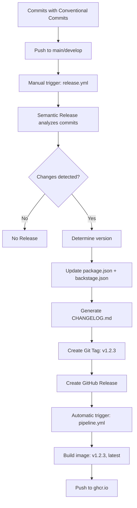

# 🚀 Semantic Release - Automated Versioning

## 📋 Table of Contents

- [What is Semantic Release?](#-what-is-semantic-release)
- [Complete Workflow](#-complete-workflow)
- [Conventional Commits](#-conventional-commits)
- [How to Use](#-how-to-use)
- [Configuration](#-configuration)
- [Versioned Docker Images](#-versioned-docker-images)
- [Troubleshooting](#-troubleshooting)
- [Best Practices](#-best-practices)

---

## 🎯 What is Semantic Release?

**Semantic Release** automates project versioning based on commit messages that follow the [Conventional Commits](https://www.conventionalcommits.org/) specification.

### Benefits

- ✅ **Automatic versioning** based on commits
- ✅ **Automated CHANGELOG** with features and fixes
- ✅ **GitHub Releases** with generated release notes
- ✅ **Versioned Docker images** automatically
- ✅ **Zero manual intervention** - fully integrated into pipeline

### Architectural Decisions

| Criterion     | Solution                | Rationale                              |
|---------------|-------------------------|----------------------------------------|
| **Trigger**   | Manual (workflow_dispatch) | ✅ Full control, no surprises       |
| **Branches**  | main (prod) + develop (pre-release) | ✅ GitFlow compatible      |
| **Config**    | `.releaserc.json`       | ✅ Simple and maintainable             |
| **Commits**   | Conventional Commits    | ✅ Industry standard                   |
| **Pipeline**  | All in GitHub Actions   | ✅ No external scripts                 |

---

## 🔄 Complete Workflow



### Step-by-Step Process

1. **Develop** with conventional commits
2. **Push to main/develop**
3. **Manual trigger** of release workflow
4. **Semantic Release analyzes** commits since last release
5. **Determines version** (major/minor/patch)
6. **Updates files**: `package.json`, `backstage.json`, `CHANGELOG.md`
7. **Creates tag**: `v1.2.3`
8. **Creates GitHub Release** with automated notes
9. **CI/CD Pipeline** detects tag and builds versioned image

---

## 📝 Conventional Commits

### Format

```text
<type>(<scope>): <description>

[optional body]

[optional footer(s)]
```

### Commit Types and Versioning

| Type | Release | Description | Example |
|------|---------|-------------|---------|
| `feat` | **MINOR** | New functionality | `feat: add user authentication` |
| `fix` | **PATCH** | Bug fix | `fix: correct login validation` |
| `perf` | **PATCH** | Performance improvement | `perf: optimize database queries` |
| `refactor` | **PATCH** | Code refactoring | `refactor: simplify auth logic` |
| `docs` | ❌ No Release | Documentation | `docs: update API documentation` |
| `chore` | ❌ No Release | Maintenance tasks | `chore: update dependencies` |
| `test` | ❌ No Release | Tests | `test: add unit tests for auth` |
| `ci` | ❌ No Release | CI/CD | `ci: update GitHub Actions` |

### Breaking Changes (MAJOR)

For backwards-incompatible changes, use `!` or `BREAKING CHANGE:`:

```bash
# Option 1: With !
feat!: migrate to new authentication API

# Option 2: With footer
feat: migrate to new authentication API

BREAKING CHANGE: The old auth API is no longer supported.
Users must update their credentials.
```

### Scopes (Optional)

Help categorize changes:

```bash
feat(auth): add OAuth2 support
fix(api): correct endpoint validation
perf(database): optimize connection pool
```

---

## 🚀 How to Use

### 1️⃣ Create Conventional Commits

```bash
# Feature (increments MINOR: 1.0.0 → 1.1.0)
git commit -m "feat: add user profile page"

# Fix (increments PATCH: 1.1.0 → 1.1.1)
git commit -m "fix: correct avatar upload"

# Breaking Change (increments MAJOR: 1.1.1 → 2.0.0)
git commit -m "feat!: migrate to GraphQL API"
```

### 2️⃣ Push to Main or Develop

```bash
# For production release
git push origin main

# For pre-release (beta)
git push origin develop
```

### 3️⃣ Execute Release Workflow

#### Option A: From GitHub UI (Recommended)

1. Navigate to **Actions** → **🚀 Semantic Release**
2. Click **Run workflow**
3. Select branch: `main` or `develop`
4. **Dry run**: `false` (for actual release)
5. Click **Run workflow**

#### Option B: Dry Run (Preview)

1. Navigate to **Actions** → **🚀 Semantic Release**
2. Click **Run workflow**
3. **Dry run**: `true` ✅
4. Review logs to see what version would be generated
5. If correct, execute with dry run: `false`

### 4️⃣ Verify Release

```bash
# View releases on GitHub
https://github.com/[your-org]/backstage/releases

# Pull versioned image
docker pull ghcr.io/[your-org]/backstage:v1.2.3
docker pull ghcr.io/[your-org]/backstage:latest
```

---

## 💡 Practical Examples

### Example 1: Feature Release (Minor)

```bash
# Scenario: Add new functionality
git commit -m "feat: add catalog entity search"
git commit -m "feat: add advanced filters"
git push origin main

# Execute release workflow
# Result: 1.0.0 → 1.1.0
# CHANGELOG:
# ## 1.1.0 (2025-10-01)
# ### ✨ Features
# - add catalog entity search
# - add advanced filters
```

### Example 2: Bug Fix Release (Patch)

```bash
# Scenario: Fix bugs
git commit -m "fix: correct search pagination"
git commit -m "fix: handle empty results"
git push origin main

# Execute release workflow
# Result: 1.1.0 → 1.1.1
```

### Example 3: Breaking Change (Major)

```bash
# Scenario: Backwards-incompatible change
git commit -m "feat!: migrate to new plugin API

BREAKING CHANGE: Plugins must implement new IPlugin interface.
Old plugins are no longer compatible."

git push origin main

# Execute release workflow
# Result: 1.1.1 → 2.0.0
```

### Example 4: No Release

```bash
# Scenario: Only chores and docs
git commit -m "chore: update dependencies"
git commit -m "docs: update README"
git push origin main

# Execute release workflow
# Result: No release created (expected)
```

---

## 🔧 Configuration

### `.releaserc.json`

```json
{
  "branches": [
    "main",                    // Production releases: v1.2.3
    {
      "name": "develop",
      "prerelease": true       // Pre-releases: v1.2.3-develop.1
    }
  ],
  "plugins": [
    "@semantic-release/commit-analyzer",      // Analyzes commits
    "@semantic-release/release-notes-generator", // Generates CHANGELOG
    "@semantic-release/changelog",            // Updates CHANGELOG.md
    "@semantic-release/npm",                  // Updates package.json (no publish)
    "@semantic-release/exec",                 // Updates backstage.json
    "@semantic-release/git",                  // Commits changes
    "@semantic-release/github"                // Creates GitHub Release
  ]
}
```

### Automatically Updated Files

- ✅ `package.json` - version field
- ✅ `backstage.json` - version field
- ✅ `CHANGELOG.md` - release notes
- ✅ `.version` - auxiliary file

### Required Permissions

**IMPORTANT**: You must enable write permissions for GitHub Actions.

1. Navigate to: `Settings` → `Actions` → `General`
2. Scroll to: **Workflow permissions**
3. Select: ✅ **Read and write permissions**
4. Save changes

---

## 🐳 Versioned Docker Images

### Generated Tags

When Semantic Release creates a tag `v1.2.3`, the pipeline automatically generates:

```bash
# Versioned tag
ghcr.io/[your-org]/backstage:v1.2.3

# Latest (main only)
ghcr.io/[your-org]/backstage:latest

# SHA (always)
ghcr.io/[your-org]/backstage:abc123def
```

### Using Images

```bash
# Latest stable version
docker pull ghcr.io/[your-org]/backstage:latest

# Specific version (recommended for production)
docker pull ghcr.io/[your-org]/backstage:v1.2.3

# Pre-release
docker pull ghcr.io/[your-org]/backstage:v1.3.0-develop.1

# By SHA (debugging)
docker pull ghcr.io/[your-org]/backstage:abc123def
```

---

## 🔍 Troubleshooting

### ❌ "No new version is released"

**Cause**: No release-triggering commits since last version.

**Solution**:

```bash
# Check latest tag
git describe --tags --abbrev=0

# View commits since last tag
git log v1.2.3..HEAD --oneline

# If only chores/docs exist, no release is expected behavior
# You need commits of type: feat, fix, perf, etc.
```

### ❌ "The local branch main is behind the remote one"

**Cause**: Semantic Release creates commits and needs to push.

**Solution**:

- Already configured in the workflow
- Verify permissions in Settings → Actions → General → Workflow permissions: "Read and write"

### ❌ "ENOCHANGE: No commits found"

**Cause**: No new commits or all include `[skip ci]`.

**Solution**:

- Normal if you just executed a release
- Create more commits with relevant changes

### ❌ Permission errors

**Cause**: Workflow without write permissions

**Solution**:

1. Settings → Actions → General
2. Workflow permissions: "Read and write"

### 🔍 Verify Version to Generate (Dry Run)

```bash
# Option 1: From GitHub UI
Actions → 🚀 Semantic Release → Run workflow → Dry run: true

# Option 2: Locally (requires npm install)
npx semantic-release --dry-run
```

---

## 📊 Semantic Versioning

### Format: `MAJOR.MINOR.PATCH`

```text
1.2.3
│ │ │
│ │ └─ PATCH: Bug fixes, performance, refactors
│ └─── MINOR: New features (backwards compatible)
└───── MAJOR: Breaking changes
```

### Increment Examples

| Current Version | Commit | New Version |
|----------------|--------|---------------|
| `1.0.0` | `feat: add search` | `1.1.0` |
| `1.1.0` | `fix: correct bug` | `1.1.1` |
| `1.1.1` | `feat!: breaking API` | `2.0.0` |
| `1.1.1` | `docs: update README` | `1.1.1` (no change) |
| `1.1.1` | `chore: update deps` | `1.1.1` (no change) |

---

## 🎯 Best Practices

### ✅ DO

- ✅ **Atomic commits** - One commit, one purpose
- ✅ **Clear messages** - Describe WHAT and WHY
- ✅ **Use scopes** - Categorize changes (`feat(auth):`)
- ✅ **Dry run first** - Verify before release
- ✅ **Explicit breaking changes** - Use `!` or `BREAKING CHANGE:`
- ✅ **Release from main** - Production only from main
- ✅ **Pre-release on develop** - Testing on develop

### ❌ DON'T

- ❌ **Generic commits** - "fix stuff", "updates"
- ❌ **Mix types** - One commit with feat + fix
- ❌ **Manual tags** - Let semantic-release handle versions
- ❌ **Skip CI on features** - Only for release commits
- ❌ **Ad-hoc releases** - Follow the established process

---

## 🔑 Useful Commands

```bash
# View latest tag
git describe --tags --abbrev=0

# View commits since last release
git log $(git describe --tags --abbrev=0)..HEAD --oneline

# View all releases
git tag -l

# View commits by type
git log --oneline | grep "^feat:"
git log --oneline | grep "^fix:"

# Verify what would be released (requires installed deps)
npx semantic-release --dry-run
```

---

## ✅ Pre-Release Checklist

Before your first release, verify:

- [ ] Dependencies installed (`yarn install`)
- [ ] GitHub Actions permissions configured (Read and write)
- [ ] Commits on main follow conventional format
- [ ] Dry run executed successfully
- [ ] Documentation reviewed

---

## 🎯 Implementation Philosophy

### ✅ KISS - Keep It Simple, Stupid

- Simple configuration in `.releaserc.json`
- Everything in GitHub Actions (no scripts)
- Manual trigger (full control)
- Dry run for preview

### ✅ DRY - Don't Repeat Yourself

- Centralized configuration
- Reusable workflows
- Conventional Commits as single source of truth

### ✅ GitOps Ready

- Everything versioned in Git
- Automatic tags
- Reproducible releases
- Automated post-release pipeline

---

## 📚 References

- [Conventional Commits](https://www.conventionalcommits.org/)
- [Semantic Versioning](https://semver.org/)
- [Semantic Release Docs](https://semantic-release.gitbook.io/)
- [GitHub Actions](https://docs.github.com/en/actions)

---

## 🎉 Production Ready

Your repository now has professional automated versioning.

**Basic workflow**:

1. ✅ Create commits with conventional format
2. ✅ Push to main/develop
3. ✅ Execute release workflow (dry run first)
4. ✅ Verify GitHub Release and Docker images
5. ✅ Celebrate 🎉
